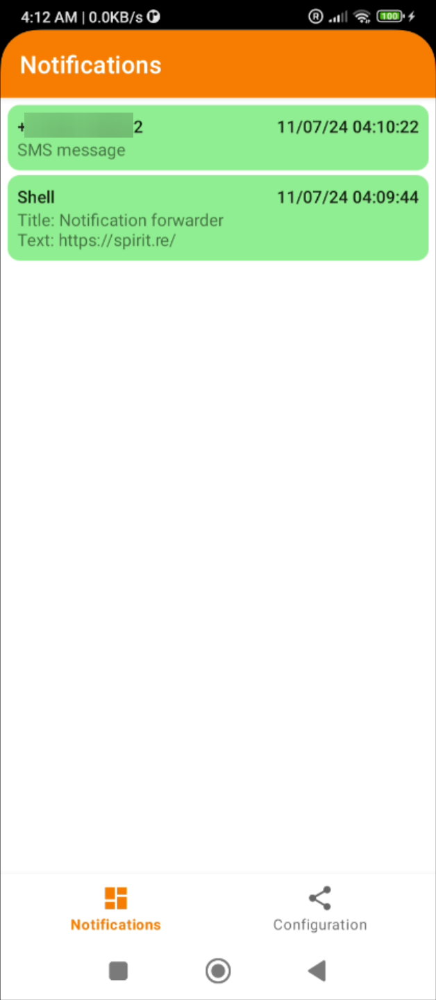
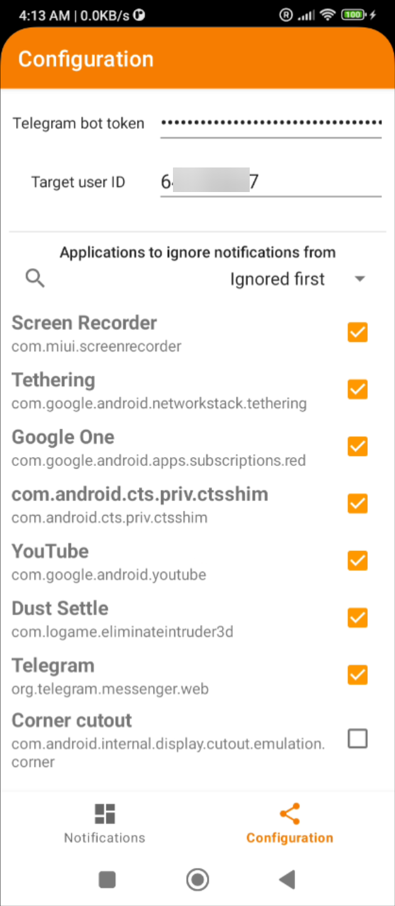
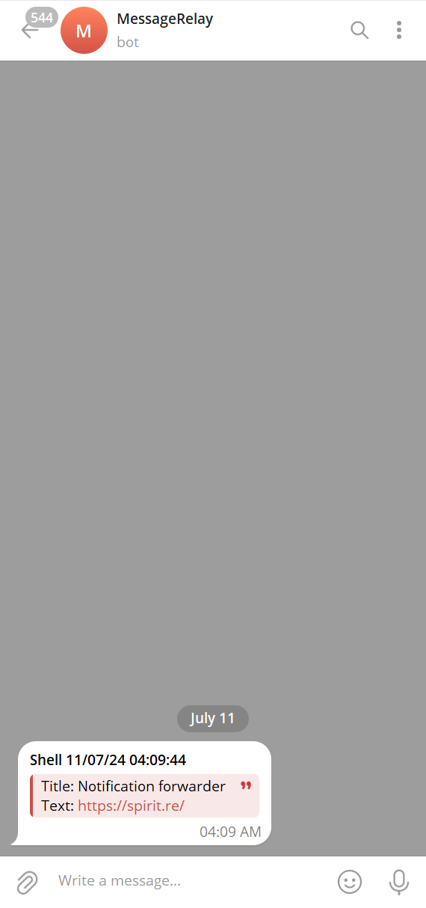

# SMSForwarder
### An app that allows you to forward all of your SMS messages and system notifications to anyone on Telegram via your own bot.

# Why would anyone do this?
The answer is rather silly.\
When traveling/moving somewhere, one may require to use a local SIM card for internet access or to receive local correspondence.\
A problem arises when you either have a phone that can only accept one SIM card, or what's more often the case, a phone with both SIM slots used up.\
\
You may be thinking - "surely a solution exists that allows you to carry a small, pocket-sized device with more SIM slots that could keep them online and connected for important notifications?"\
I thought so too. After spending a few hours scouring the internet, it all led to one conclusion:\
While this technically does exist, it only exists as proprietary, very shady phones-in-a-box that tend to phone home to a server _somewhere_ on the planet, and often require a subscription.\
I don't like subscriptions. Or shady services.

*So I made this thing.*

# How does it work?
It uses Android's default notification listener functionality to grab all system notifications, as well as the SMS notification functionality to listen to incoming SMS messages.\
When either is received, it's put into a queue, which a foreground service then attempts to send via a POST request to Telegram, with your own bot token and your own user ID.\
If it fails, it keeps it in the queue and repeats transmission attempts ad infinitum, to ensure that you don't miss anything important(like a 3D-secure bank token).

|    Notification dashboard    |      Configuration page      |      Received messages       |
|:----------------------------:|:----------------------------:|:----------------------------:|
|  |  |  |

https://github.com/Spirit532/SMSForwarder/assets/13601407/e57fed8f-af6b-4bd7-bcb4-d82905b44ddd

# How do I use it?
1. Buy a cheap smartphone with dual standby to stick your extra SIMs in.
2. Connect it to the internet permanently. Either via home WiFi, cell data, ethernet, or all three.
3. Install the app. Grant all permission requests. _Yes, even the spooky ones(see next section)._
4. Set the app to never be shut down, disable all battery optimizations for it.
5. Use the official [Botfather](https://t.me/botfather) bot on Telegram to create your own bot.
6. If not sending to groups, turn off the bot's ability to join channels.
7. Optionally, set the bot's profile picture to the provided [logo](./media/telegram_bot_icon.png) to maintain visual coherency.
8. Take the bot token, put it in the ``Telegram bot token`` box in the app.
9. Use any third-party user info bot to find out your user ID. Put it in the ``Target user ID`` box.
10. Configure apps you don't want to receive notifications for. If the box is checked, the app is ignored.

# Is it safe?

### Message security
Probably safe enough for the average user, but Telegram's bot messages are __unencrypted__, so using this for anything confidential would be a bad idea, but for time-critical stuff like SMS login tokens and 3D-secure, it shouldn't pose too much of a safety risk.\
If you are more paranoid than me, and can write code, pull requests to support slightly safer apps(i.e. Signal) are welcome.

### App safety
The app requests a lot of very spooky permissions, including ones that are not normally granted to apps. This, (un)fortunately, is required to catch every notification.\
You should only compile the app yourself, or install it from the releases in this repo.
#### This app is not published on any app stores. Do not install it from anywhere except this repo.
####  If you find it elsewhere, chances are it's going to be malware.

# Is it good code?
Absolutely not, not even in the slightest.\
I made this in just one day, by abusing LLMs to do the monkey-with-typewriter thing.\
The amount of effort involved in this is as low as I could achieve while making it function.\
Programmers beware, there be dragons and several dumpster fires.
